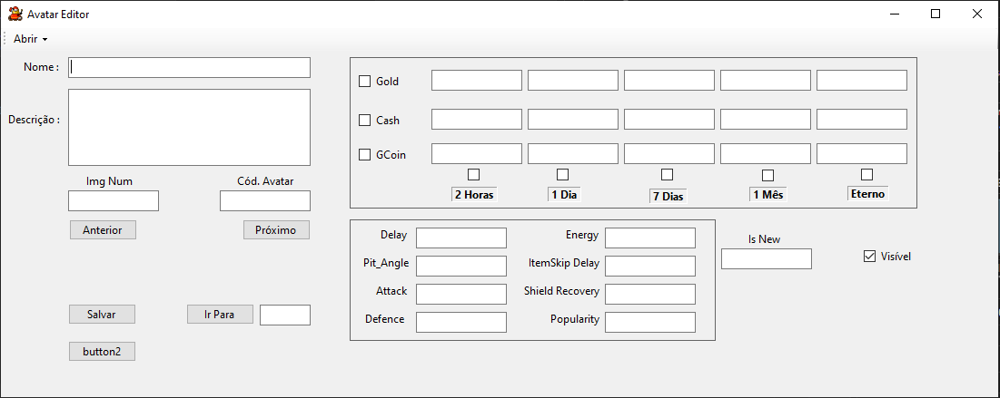

# Avatar Editor

## Overview
Avatar Editor is a tool designed to open and modify `.dat` files that contain avatar data. It reads the total number of blocks (or avatars) from the first 4 bytes of the file and then processes the remaining bytes to extract individual avatar blocks.

Each encrypted avatar block is **256 bytes**, and after decryption, it expands to **644 bytes**. The decryption process is handled using the `GBCrypto.Decompress` function. The decrypted data is stored in a temporary variable for further editing.

---

## Features
✅ **Decrypt and encrypt** `.dat` files using LZHuff  
✅ **Read all bytes** and load them into their corresponding fields  
✅ **Save files in both encrypted and decrypted formats**  

---

## To-Do List
🔹 Implement routines to open `ex-item` and `avatar.dat` files from **Season 3**  
🔹 Understand how the game calculates CRC for file validation  
🔹 Create a routine to generate a new CRC when avatar data is modified  

---

## Screenshots

---

## How to Use
1. Open a `.dat` file.
2. The program will read and decrypt the avatar blocks automatically.
3. Edit the data as needed.
4. Save the file in either encrypted or decrypted format.

---

## Requirements
- .NET Framework or .NET Core
- C# runtime environment

---

## Contribution
Feel free to contribute by reporting issues or suggesting improvements!

---

## License
MIT License

